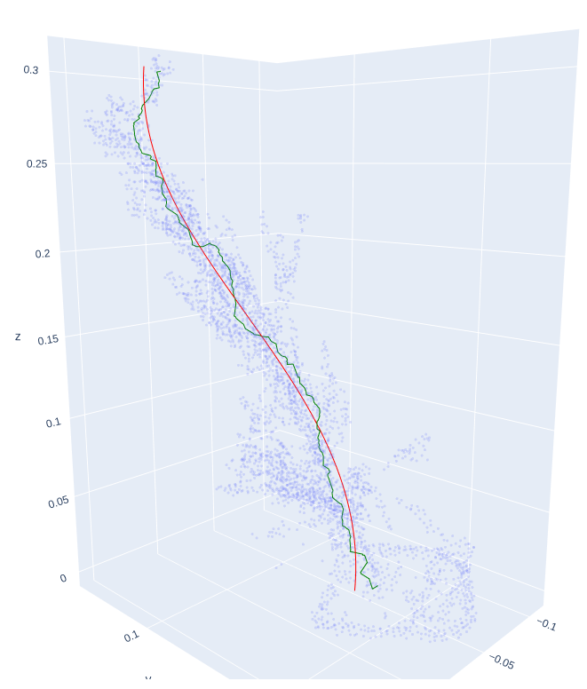

# StemMove
Tools to analyse tree stem movement from 3D point cloud series.

`pc2line.py` extracts the shortest path throught a given point cloud linking 2
end points specified by the user. Raw and smoothed version of the path lines
are written to disk (as `numpy` arrays).
This is an implementation of the Iddo-Haniel 'spine-finding' algorithm.

`show_spine.py` can be used to explore point cloud data and display the spine
lines generated by the script above.

